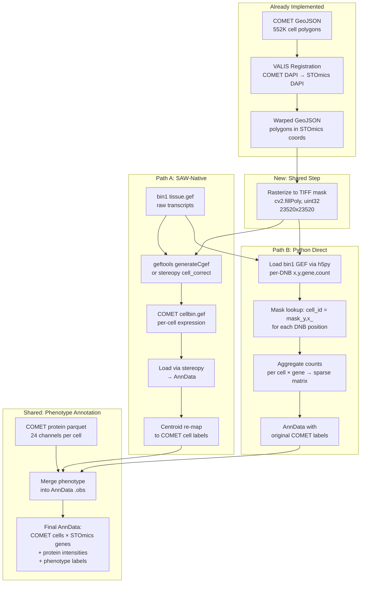

# Assign STOmics Transcripts to COMET-Defined Cells with Phenotypes

## Overview

Use COMET cell segmentation polygons (from Visiopharm) and their phenotype designations as the cell boundaries for STOmics transcript assignment, replacing the default STOmics cell segmentation. Implement two complementary pathways: a SAW-native approach (geftools) for compatibility with STOmics downstream tools, and a Python-based approach for flexible analysis with full COMET phenotype metadata.

## Problem Frame

The existing pipeline (`alignment_utils.py`) already:
1. Warps COMET cell segmentations to STOmics coordinate space via VALIS
2. Aggregates STOmics expression per COMET cell from the **existing cellbin GEF** (STOmics-segmented cells)

But this has two limitations:
- It maps COMET cells to **STOmics-defined cells** rather than assigning **raw transcripts** directly to COMET cell boundaries
- It does not carry COMET phenotype designations (CD4+ T cells, macrophages, etc.) through to the transcriptomic data

The goal is to use the **raw bin1 GEF** (individual DNB transcript positions) and assign each transcript to the COMET cell polygon it falls within, producing per-cell gene expression matrices that are defined by COMET boundaries and annotated with COMET phenotypes.

## Requirements Trace

- R1. Rasterize warped COMET GeoJSON polygons into a TIFF cell mask in STOmics coordinate space
- R2. Generate SAW-compatible cellbin GEF using geftools `generateCgef` (or stereopy `cell_correct`) from bin1 GEF + COMET mask
- R3. Implement Python-based direct transcript-to-cell assignment using bin1 GEF + shapely point-in-polygon, outputting AnnData
- R4. Carry COMET protein intensities and phenotype annotations into the output AnnData `.obs`
- R5. Validate both approaches against each other and against the existing cellbin (STOmics-segmented) data
- R6. Work on SO34 pilot (only Endo/MLA sample with full data), validate on SO4 (Ovarian)

## Scope Boundaries

- This plan covers the transcript assignment pipeline, NOT upstream registration (already implemented)
- Does not re-implement VALIS registration or GeoJSON warping (use existing `alignment_utils.py`)
- Does not address the STOmics data gap for 14 of 15 Endo/MLA samples (separate Track 2 in alignment plan)
- Does not build a batch processing wrapper (future script, after pilot validation)
- Phenotype annotations come from existing COMET protein analysis parquet files; this plan does not re-run phenotyping

## Context & Research

### Relevant Code and Patterns

- `comet/alignment_utils.py` — Full alignment pipeline including `warp_geojson_with_valis()`, `aggregate_expression_per_comet_cell()`, `load_stomics_cellbin_gef()`, `PROTEIN_GENE_MAP`
- `comet/script03_comet_stomics_alignment.ipynb` — Pilot notebook demonstrating alignment on SO34
- `comet/script01_comet_analysis.py` — COMET protein intensity extraction per cell (output: `{SO}_BS_protein_combined.parquet`)
- `stomics/saw-8.2.2/anaconda_3.10/lib/python3.10/site-packages/gefpy/` — gefpy package with `cgef_writer_cy`, `cgef_adjust_cy`, `cell_mask_annotation.py`
- `stomics/saw-8.2.2/lib/geftools/include/main_cgef.h` — `generateCgef(cgef_file, bgef_file, mask_file, block_size)` C++ API
- `stomics/saw-8.2.2/lib/geftools/include/mask.h` — Mask class: reads TIFF, uses OpenCV `findContours`/`connectedComponentsWithStats` to identify cells
- `stomics/saw_data_audit.py` — Audit script showing data locations for all chips
- `PLAN_comet_mask_for_stomics.md` — Prior plan covering SAW-native approach (origin document)

### Key Technical Findings from Research

**SAW/geftools mask processing:**
- `generateCgef()` accepts: bin1 bGEF + TIFF mask → produces cellbin GEF
- The mask is processed with OpenCV `connectedComponentsWithStats()` — each connected nonzero region becomes one cell
- **Cell IDs are re-numbered** by geftools (sequential from 1) — original COMET labels are NOT preserved
- Mask pixel coordinates must match the bin1 GEF coordinate system (= STOmics registered DAPI pixel space)
- Mask dtype: uint32 required for >65,535 cells (SO34 has ~552K cells)

**Stereopy `cell_correct()` API:**
- Python wrapper around geftools `generateCgef` + optional border expansion
- `method='FAST'` is appropriate when masks already represent full cell boundaries (not just nuclei)
- `method='EDM'` expands cell borders by `distance` pixels (default 10) — use only if COMET masks are nuclear-only
- Output: `.adjusted.cellbin.gef` and `.raw.cellbin.gef`

**Bin1 GEF structure (raw transcript data):**
- HDF5: `/geneExp/bin1/gene` (gene metadata with offset/count) + `/geneExp/bin1/expression` (x, y, count per record)
- Each record is one DNB spot (500nm spacing) with gene assignment and MID count
- Attributes: `offsetX`, `offsetY` (minimum coordinates), `resolution` (500nm)

**Cellbin GEF output structure:**
- `/cellBin/cell` — per-cell metadata (id, x, y, area, dnbCount, geneCount, expCount)
- `/cellBin/cellExp` — sparse (geneID, count) per cell
- `/cellBin/cellBorder` — 32-point polygon per cell (relative to centroid)
- `/cellBin/gene` — gene metadata
- `/cellBin/geneExp` — sparse (cellID, count) per gene

**COMET phenotype tree (from READ_ME.xlsx):**
- CD45+ → Immune cells
- CD45+/CD4+ → CD4 T cells; CD45+/CD4+/FOXP3+ → Tregs; etc.
- Phenotype assignments stored in COMET protein parquet files

### Data Available for SO34 Pilot

| File | Location | Notes |
|------|----------|-------|
| Warped GeoJSON | `projects/out/comet_stomics_alignment/SO34_A03979E2/SO34_warped_segmentations.geojson` | 552K cells in STOmics coords |
| COMET protein data | `projects/out/out_comet/SO34_BS_protein_combined.parquet` | 24 channels per cell |
| STOmics tissue.gef | `A03979E2/01.StandardWorkflow_Result/.../A03979E2.tissue.gef` | ~320MB, bin1 raw expression |
| STOmics DAPI | `A03979E2/03.ssDNA_analysis/ssDNA_A03979E2_regist.tif` | 23,520x23,520, coord reference |
| STOmics cellbin.gef | `A03979E2/03.ssDNA_analysis/A03979E2.adjusted.cellbin.gef` | Existing STOmics-segmented (for comparison) |
| VALIS registrar | `projects/out/comet_stomics_alignment/SO34_A03979E2/registration_output/` | Pre-computed |

## Key Technical Decisions

- **uint32 mask**: SO34 has ~552K cells, exceeding uint16 max (65,535). Use uint32 TIFF throughout.
- **No border expansion**: COMET Visiopharm masks represent full cell boundaries (not just nuclei), so `cell_correct(method='FAST')` or `adjusted-distance=0` is appropriate.
- **Cell ID re-mapping**: Since geftools renumbers cells, we must re-map output cellbin GEF cells back to COMET labels via centroid spatial join. The Python approach preserves original labels directly.
- **Rasterization tool**: Use `cv2.fillPoly()` — fastest for large polygon counts; handles interior holes correctly.
- **Both approaches output AnnData**: SAW-native cellbin GEF is loaded into AnnData via stereopy; Python approach creates AnnData directly. Both get COMET phenotype annotations merged into `.obs`.

## Open Questions

### Resolved During Planning

- **Q: Can geftools accept labeled (non-binary) masks?** Yes — `connectedComponentsWithStats` treats each connected nonzero region as a separate cell regardless of pixel value. Labels are renumbered.
- **Q: Which GEF file is the input?** The bin1 bGEF (`.tissue.gef` or `.raw.gef`), NOT the existing `.cellbin.gef`.
- **Q: Does STOmics DAPI coordinate space = GEF coordinate space?** Yes — the `*_regist.tif` pixel grid matches bin1 GEF (x, y) values.
- **Q: Which cell_correct method?** `FAST` — assigns by distance to centroid without expanding the mask. Appropriate for full-cell boundaries.

### Deferred to Implementation

- **Q: How well do COMET-derived cell counts compare to STOmics-derived?** Depends on alignment quality and tissue coverage overlap — evaluate during validation.
- **Q: Should we use `.tissue.gef` or `.raw.gef`?** Try `.tissue.gef` first (filtered to tissue region); fall back to `.raw.gef` if needed.
- **Q: Exact phenotype classification rules from COMET protein intensities.** Need to check `READ_ME.xlsx` and existing phenotyping code during implementation.

## High-Level Technical Design

> *This illustrates the intended approach and is directional guidance for review, not implementation specification. The implementing agent should treat it as context, not code to reproduce.*



## Implementation Units

- [x] **Unit 1: Rasterize warped GeoJSON to TIFF cell mask**

**Goal:** Convert warped COMET cell polygons (in STOmics coordinate space) into a labeled uint32 TIFF mask matching STOmics DAPI dimensions.

**Requirements:** R1

**Dependencies:** Warped GeoJSON must exist (already produced by `run_alignment_pipeline`)

**Files:**
- Modify: `comet/alignment_utils.py` (add `rasterize_geojson_to_mask()`)
- Test: manual validation in Unit 5 notebook

**Approach:**
- Read STOmics DAPI image dimensions to determine mask shape
- Iterate over GeoJSON features, use `cv2.fillPoly()` to fill each polygon with its cell label
- Handle overlapping polygons: last-writer-wins (cells are generally non-overlapping from Visiopharm)
- Save as uint32 TIFF with LZW compression
- Return the mask array and save path
- Add a `DefaultPaths.stomics_tissue_gef_path()` class method to locate tissue.gef

**Patterns to follow:**
- `export_geojson_from_tif()` in alignment_utils.py (line 1341) for TIFF I/O patterns
- `cv2.fillPoly()` usage in `gefpy/cell_mask_annotation.py` (line 90)

**Test scenarios:**
- Mask dimensions match STOmics DAPI (23,520 × 23,520 for SO34)
- Cell count in mask (unique nonzero values) matches GeoJSON feature count
- No uint32 overflow (max label < 2^32)
- Background pixels (outside tissue) remain 0
- Mask file size is reasonable (compressed ~100-300 MB)

**Verification:**
- Visual overlay of mask on STOmics DAPI shows correct spatial alignment
- `np.unique(mask)` count matches GeoJSON feature count ± small tolerance for sub-pixel polygons

---

- [x] **Unit 2: SAW-native cellbin GEF generation (Path A)**

**Goal:** Use geftools/stereopy to generate a cellbin GEF from the COMET mask + bin1 tissue.gef, producing a SAW-compatible output.

**Requirements:** R2

**Dependencies:** Unit 1 (mask TIFF)

**Files:**
- Modify: `comet/alignment_utils.py` (add `generate_cellbin_with_comet_mask()`)

**Approach:**
- Primary: Use stereopy `cell_correct(bgef_path, mask_path, method='FAST', out_dir=...)`
- Fallback: Use geftools CLI via subprocess (`cellCut cgef -i tissue.gef -m mask.tif -o output.cellbin.gef`)
- Locate the bin1 tissue.gef using `DefaultPaths` (search `01.StandardWorkflow_Result/GeneExpMatrix/` or `03.ssDNA_analysis/`)
- Handle stereopy import errors gracefully (not always installed)
- Output: `.raw.cellbin.gef` and `.adjusted.cellbin.gef`

**Patterns to follow:**
- `load_stomics_cellbin_gef()` in alignment_utils.py (line 655) for GEF loading with fallback chain
- `cell_mask_annotation.py` MaskSegmentation class for gefpy API patterns

**Test scenarios:**
- Output cellbin GEF is valid HDF5 with `/cellBin/cell`, `/cellBin/cellExp`, `/cellBin/gene` groups
- Cell count in output is reasonable (may differ slightly from mask due to geftools re-labeling)
- Gene count matches input tissue.gef gene count
- Total MID count in cellbin ≤ total MID count in tissue.gef (some DNBs fall outside cells)

**Verification:**
- Load output with `st.io.read_gef(path, bin_type='cell_bins')` successfully
- Cell centroids from output overlap spatially with COMET polygon centroids

---

- [x] **Unit 3: Python direct transcript-to-cell assignment (Path B)**

**Goal:** Load raw bin1 GEF transcripts via h5py, use the rasterized mask for spatial lookup, and aggregate gene expression per COMET cell into AnnData — preserving original COMET cell labels.

**Requirements:** R3

**Dependencies:** Unit 1 (mask TIFF)

**Files:**
- Modify: `comet/alignment_utils.py` (add `aggregate_transcripts_by_mask()`)

**Approach:**
- Load bin1 GEF via h5py: iterate over genes, for each gene read expression records (x, y, count)
- For each DNB position, look up cell assignment: `cell_id = mask[y, x]`
- Skip DNBs where `cell_id == 0` (background)
- Build sparse COO matrix: rows = cell indices, cols = gene indices, values = summed counts
- Convert to CSR → AnnData
- `.obs`: cell_label (original COMET), centroid_x, centroid_y, area_px, n_transcripts, n_genes
- `.obsm['spatial']`: centroid coordinates
- `.var`: gene names from GEF
- `.uns`: metadata (sample_id, chip_id, method='direct_mask_lookup')

**Technical design:**

> *Directional guidance, not implementation specification.*

```
1. Load mask (uint32 TIFF) into memory
2. Open bin1 GEF with h5py
3. Read gene metadata: gene_names, offsets, counts
4. For each gene:
   a. Read expression slice: expr[offset:offset+count] → (x, y, count)
   b. cell_ids = mask[y_array, x_array]  # vectorized lookup
   c. Accumulate into sparse triplets: (cell_ids, gene_idx, counts)
5. Filter out cell_id=0 entries
6. Build cell_id → row_index mapping
7. Construct sparse CSR matrix
8. Build AnnData with obs/var/obsm
```

**Patterns to follow:**
- `_load_cellbin_h5py()` in alignment_utils.py (line 759) for h5py GEF reading patterns
- `_aggregate_by_polygon()` in alignment_utils.py (line 954) for AnnData construction

**Test scenarios:**
- All DNBs within the mask tissue region are assigned to cells (no silent drops)
- Total MID count equals sum of all cell expression values (conservation of counts)
- Cell count in output matches unique nonzero mask values
- Gene count matches bin1 GEF gene count
- Output AnnData `.X` is sparse and non-negative

**Verification:**
- Compare total transcript count: `adata.X.sum()` ≈ total DNBs within mask region
- Compare cell count between Path A and Path B outputs (should be very close)
- Spot-check: for a known cell, verify gene expression makes biological sense

---

- [x] **Unit 4: Merge COMET phenotype annotations into output AnnData**

**Goal:** Attach COMET protein intensities (24 channels) and phenotype classifications to the output AnnData objects from both paths.

**Requirements:** R4

**Dependencies:** Units 2 and 3 (AnnData outputs), COMET protein parquet file

**Files:**
- Modify: `comet/alignment_utils.py` (add `annotate_with_comet_phenotypes()`)

**Approach:**
- Load COMET protein parquet (`{SO}_BS_protein_combined.parquet`) — columns are protein channels + centroid_x, centroid_y
- For Path B: direct join on cell_label (original COMET labels preserved)
- For Path A: centroid-based spatial join (KD-tree) since geftools renumbers cells
  - Build KD-tree on COMET protein centroid coordinates (warped to STOmics space via VALIS)
  - For each cellbin GEF cell centroid, find nearest COMET protein cell
  - Accept match if distance < threshold (e.g., 30px)
- Add protein intensities as columns in `.obs` (e.g., `protein_CD4`, `protein_CD8`, ...)
- Add phenotype classification based on marker thresholds (from phenotyping tree)
- Store protein data in `.obsm['comet_protein']` as a (n_cells × 24) matrix

**Patterns to follow:**
- `validate_protein_gene_correlation()` in alignment_utils.py (line 1265) for protein-gene matching
- `PROTEIN_GENE_MAP` dictionary for channel-to-gene name mapping
- `map_comet_to_stomics_cells()` for KD-tree spatial join pattern

**Test scenarios:**
- All cells with matched protein data have 24 non-NaN protein values
- Phenotype labels are consistent with marker expression (e.g., CD45+ cells have high CD45)
- Spatial join for Path A matches >90% of cells within 30px

**Verification:**
- `adata.obs['phenotype'].value_counts()` shows reasonable cell type distribution
- Protein-gene correlations (e.g., CD4 protein vs CD4 gene) are positive and significant

---

- [x] **Unit 5: Pilot notebook on SO34 with validation**

**Goal:** Create an interactive notebook demonstrating both pathways on SO34, with side-by-side validation against the existing STOmics cellbin data.

**Requirements:** R5, R6

**Dependencies:** Units 1-4

**Files:**
- Create: `comet/script06_comet_cellbin_generation.ipynb`

**Approach:**
- Section 1: Load warped GeoJSON + verify alignment (reuse script03 patterns)
- Section 2: Rasterize to mask, inspect mask visually
- Section 3: Path A — generate cellbin GEF via stereopy, load result
- Section 4: Path B — direct transcript aggregation via h5py
- Section 5: Merge COMET phenotypes into both AnnData objects
- Section 6: Comparison
  - Path A vs Path B: cell count, total transcripts, gene detection rate
  - COMET-segmented vs STOmics-segmented: cell count, median genes/cell, spatial coverage
  - Protein-gene correlation analysis (validation of alignment quality)
- Section 7: Exploratory analysis
  - UMAP colored by COMET phenotype
  - Spatial plot of phenotype distribution
  - Differential gene expression: immune cells vs epithelial (using COMET CD45 classification)

**Patterns to follow:**
- `comet/script03_comet_stomics_alignment.ipynb` for notebook structure and visualization patterns
- `comet/script05_batch_alignment.ipynb` for batch processing patterns

**Test scenarios:**
- Both pathways produce AnnData with consistent dimensions
- Validation plots show reasonable spatial alignment
- COMET phenotype annotations are biologically meaningful in gene expression space

**Verification:**
- Notebook runs end-to-end on SO34 without errors
- Comparison metrics are documented in notebook output
- Validation plots saved to output directory

---

- [x] **Unit 6: Validate on SO4 (Ovarian) for robustness**

**Goal:** Run the pipeline on SO4 (Ovarian, chip C03027C4) to confirm it works across tissue types.

**Requirements:** R6

**Dependencies:** Units 1-4 functional

**Files:**
- Modify: `comet/script06_comet_cellbin_generation.ipynb` (add validation section)

**Approach:**
- Reuse all functions from Units 1-4 with SO4 parameters
- Compare alignment quality between SO34 (MLA) and SO4 (Ovarian)
- Verify that phenotype annotations transfer correctly for a different tissue type

**Verification:**
- SO4 pipeline completes without errors
- Alignment quality metrics are GOOD or EXCELLENT (median distance < 50px)
- Cell count and gene detection are biologically reasonable for ovarian tissue

## System-Wide Impact

- **Interaction graph:** New functions in `alignment_utils.py` are called from the notebook; no callbacks or middleware. The `run_alignment_pipeline()` function should be extended to optionally invoke the new cellbin generation step.
- **Error propagation:** Stereopy import failure → graceful fallback to geftools CLI or Python-only path. Missing tissue.gef → clear error message with guidance.
- **State lifecycle risks:** Large arrays (mask at 23520×23520 uint32 = ~2.2GB) require memory management; process one sample at a time. Delete intermediate arrays after use.
- **API surface parity:** Both Path A and Path B should produce AnnData with identical `.obs` column schema for downstream compatibility.
- **Integration coverage:** The protein-gene correlation validation (existing in `validate_protein_gene_correlation()`) serves as the cross-layer integration test.

## Risks & Dependencies

- **Stereopy installation**: May not be available in all environments. Mitigated by geftools CLI fallback and Python-only Path B.
- **Memory**: 23520×23520 uint32 mask = 2.2GB + bin1 GEF gene iteration. Ensure machine has ≥16GB RAM. Path B processes genes iteratively to avoid loading full expression matrix.
- **Cell ID re-mapping accuracy (Path A)**: Depends on centroid matching quality. If alignment is poor, spatial join may have mismatches. Path B avoids this entirely.
- **tissue.gef availability**: Only SO34 and 5 Ovarian samples have full STOmics data on disk. Other Endo/MLA samples blocked on data acquisition (separate track).
- **Coordinate offset**: The bin1 GEF may have `offsetX`/`offsetY` attributes. Must subtract these from mask coordinates or add them to GEF coordinates to align. Verify during implementation.

## Documentation / Operational Notes

- Update `CLAUDE.md` with new script (`script06`) and new functions in `alignment_utils.py`
- The COMET phenotyping tree markers should be documented in `alignment_utils.py` alongside `PROTEIN_GENE_MAP`
- Output files follow existing convention: `{SO}_{ChipID}_comet_cellbin.gef` and `{SO}_{ChipID}_comet_transcripts.h5ad`

## Sources & References

- **Origin documents:** [PLAN_comet_mask_for_stomics.md](../../PLAN_comet_mask_for_stomics.md), [PLAN_comet_stomics_alignment.md](../../PLAN_comet_stomics_alignment.md)
- **Related code:** `comet/alignment_utils.py`, `comet/script03_comet_stomics_alignment.ipynb`
- **geftools source:** `stomics/saw-8.2.2/lib/geftools/include/main_cgef.h` — `generateCgef()` API
- **geftools mask:** `stomics/saw-8.2.2/lib/geftools/include/mask.h` — Mask class using OpenCV `findContours`/`connectedComponentsWithStats`
- **gefpy Python:** `stomics/saw-8.2.2/anaconda_3.10/.../gefpy/cell_mask_annotation.py` — `MaskSegmentation` class
- **gefpy cellbin reader:** `stomics/saw-8.2.2/anaconda_3.10/.../gefpy/cell_exp_reader.py` — HDF5 cellbin structure
- **SAW GitHub:** [STOmics/SAW](https://github.com/STOmics/SAW) — Issue #261 (third-party masks)
- **geftools GitHub:** [STOmics/geftools](https://github.com/STOmics/geftools) — `cgefCellgem.cpp` (mask processing)
- **Stereopy docs:** [cell_correct](https://stereopy.readthedocs.io/en/v1.3.1/content/stereo.tools.cell_correct.cell_correct.html)
- **GEF format spec:** [Expression Matrix Format](https://www.stomics.tech/service/saw_8_1/docs/gao-ji-she-zhi/expression-matrix-format.html)
