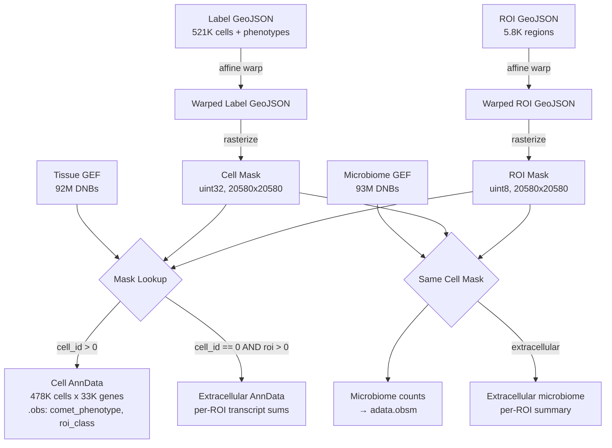

# Enhanced Transcript Assignment with COMET Phenotypes, ROI Regions, and Microbiome

## Overview

Enhance the COMET-STOmics transcript assignment pipeline to:
1. Switch from "masks" GeoJSON to "label" GeoJSON as the cell source, preserving Visiopharm-assigned phenotype classifications (24 cell types) through the spatial transform into the final AnnData
2. Warp and rasterize ROI polygons to assign each cell to its parent tissue region (Tumor/TME/Vessels/Other)
3. Capture extracellular transcripts — DNBs that fall within an ROI but outside any cell boundary
4. Integrate the STOmics microbiome GEF (2,947 microbial taxa) alongside human gene expression

## Problem Frame

The current pipeline uses `geojson_output/{SO}_BS_masks.geojson` which contains cell polygons with only `label` and `area_px` properties — no phenotype information. The proper outputs from the revised Visiopharm analysis are in `geojson/{SO}_BS_label.geojson` (cells with 24 phenotype classes) and `geojson/{SO}_BS_roi.geojson` (tissue subregions). Additionally, transcripts falling outside cells are currently discarded (93.8% of DNBs), and the microbiome analysis output is not integrated.

## Requirements Trace

- R1. Use label GeoJSON (`geojson/{SO}_BS_label.geojson`) as cell source, replacing masks GeoJSON
- R2. Preserve COMET phenotype classification (from `classification.name`) through warp into AnnData `.obs['comet_phenotype']`
- R3. Warp ROI polygons and assign each cell to its parent ROI → `.obs['roi_class']`
- R4. Capture extracellular transcripts per ROI region (DNBs within ROI but outside any cell)
- R5. Integrate microbiome GEF data, assigning microbial taxa to cells and ROI regions
- R6. Maintain backward compatibility — existing functions should continue to work with masks GeoJSON

## Scope Boundaries

- **In scope:** Label/ROI GeoJSON loading, phenotype preservation, ROI assignment, extracellular transcripts, microbiome GEF integration
- **Not in scope:** New alignment methods, protein intensity extraction (`script01_comet_analysis.py`), SAW/geftools Path A changes, batch processing automation
- **Not in scope:** Downstream analysis (DE, clustering, visualization) — those remain in notebooks

## Context & Research

### Relevant Code and Patterns

- `comet/alignment_utils.py` — core pipeline module (~2400 lines)
  - `rasterize_geojson_to_mask()` — reads `properties.label` for cell ID; needs adaptation for `object_index`
  - `aggregate_transcripts_by_mask()` — gene-by-gene h5py reading, mask lookup, COO→CSR sparse matrix; reusable for microbiome GEF
  - `annotate_with_comet_phenotypes()` — currently derives phenotypes from protein intensities; will be supplemented by direct label classification
- `comet/registration.py` — `apply_affine_to_geojson()` handles bulk coordinate transform; already used for cell GeoJSON, can reuse for ROI GeoJSON
- `comet/mld_to_geojson.py` — reference for how label/ROI GeoJSON files are generated from MLD

### Data Structures Discovered

**Label GeoJSON** (`geojson/{SO}_BS_label.geojson`):
- 521K features with `object_index` (0-based, unique per feature)
- `classification.name`: 24 phenotype classes (TUMOR CELLS CD56+, CD4 T CELLS, T REG CELLS, FIBROBLASTS, BLOOD VESSELS, etc.)
- 1,724 "Background" features and 21,237 unclassified "Cell" features to handle
- 4 features have no `classification` key
- Coordinates in COMET pixel space (0–39,600), same as masks GeoJSON

**ROI GeoJSON** (`geojson/{SO}_BS_roi.geojson`):
- 5,861 polygons across 4 classes: Tumor ROI (1,227), TME ROI (3,105), Vessels ROI (1,524), Other ROI (5)
- Same COMET coordinate space
- Polygons may overlap (a vessel can be inside tumor or TME)

**Microbiome GEF** (`02.Microbiome_analysis/{chip}.host_micro.label.gef`):
- Same HDF5 structure as tissue GEF: `/geneExp/bin1/expression` + `/geneExp/bin1/gene`
- 36,021 total features: 33,074 human genes + 2,947 microbial taxa
- Microbial taxa prefixed: `g__` (genus, 793), `s__` (species, 1576), `f__` (family, 327), `o__` (order, 150), `c__` (class, 67), `p__` (phylum, 34)
- 93M bin1 records, coordinates in STOmics space (20580×20580)

## Key Technical Decisions

- **Cell ID source**: Use `object_index + 1` from label GeoJSON as the mask label (adding 1 because 0 is reserved for background in the mask). This replaces the old `properties.label` field.
- **Background/unclassified handling**: Features classified as "Background" will be excluded from cell rasterization. Features classified as "Cell" (unclassified) will be included with phenotype "Unclassified".
- **ROI assignment strategy**: Rasterize ROI polygons into a separate categorical mask (uint8, 4 classes). Assign each cell to the ROI class at its centroid. Cells outside all ROIs get "Outside ROI".
- **ROI overlap priority**: Vessels ROI → Tumor ROI → TME ROI → Other ROI (most specific wins when a pixel belongs to multiple ROIs).
- **Extracellular transcripts**: After cell assignment, collect unassigned DNBs that fall within the ROI mask. Aggregate per ROI class into a summary AnnData or DataFrame.
- **Microbiome integration**: Run `aggregate_transcripts_by_mask` on the microbiome GEF with the same cell mask. Store microbial counts in `adata.obsm['microbiome']` with taxa names as columns. Separate human genes from microbial taxa by prefix.
- **Phenotype column naming**: Store Visiopharm phenotype as `comet_phenotype` (direct from GeoJSON) to distinguish from the existing protein-intensity-derived `phenotype` column.

## Open Questions

### Resolved During Planning

- **Q: Are label and masks GeoJSON in the same coordinate space?** Yes — both use COMET pixel coordinates (0–39,600 range matching the 39,716×39,599 image).
- **Q: Is `object_index` unique?** Yes — 521,103 unique values for 521,103 features.
- **Q: Can we reuse `aggregate_transcripts_by_mask` for microbiome?** Yes — the microbiome GEF has identical HDF5 structure.
- **Q: Does the microbiome GEF share coordinates with the tissue GEF?** Yes — both are 20,580×20,580 STOmics space.

### Deferred to Implementation

- **Exact ROI overlap handling**: If vessels overlap is rare, a simple priority rasterization may suffice. If complex, may need per-cell centroid point-in-polygon testing. Determine at runtime by checking overlap statistics.
- **Microbiome taxa filtering**: Whether to keep all 2,947 taxa or filter to those with meaningful signal (e.g., >N total counts). Decide after seeing count distributions.
- **Memory for dual GEF processing**: Processing both tissue GEF (92M records) and microbiome GEF (93M records) sequentially should be fine, but verify during execution.

## High-Level Technical Design

> *This illustrates the intended approach and is directional guidance for review, not implementation specification.*

## Implementation Units

### Phase 1: Core Label/ROI Support

- [x] **Unit 1: Adapt GeoJSON loading for label format**

**Goal:** Make `rasterize_geojson_to_mask` and `aggregate_transcripts_by_mask` work with the label GeoJSON format (which uses `object_index` + `classification` instead of `label` + `area_px`).

**Requirements:** R1, R2, R6

**Dependencies:** None

**Files:**
- Modify: `comet/alignment_utils.py`

**Approach:**
- Update `rasterize_geojson_to_mask` to accept both label formats: if `properties.label` exists use it (backward compat), otherwise use `object_index + 1`
- Filter out features with `classification.name == "Background"` during rasterization
- Extract and preserve `classification.name` as a property during rasterization so it can be carried into AnnData
- Update `aggregate_transcripts_by_mask` to populate `obs['comet_phenotype']` from the GeoJSON classification when available
- Build a `cell_id → phenotype` mapping from the warped GeoJSON and join it into obs

**Patterns to follow:**
- Existing `rasterize_geojson_to_mask` logic for polygon filling
- Existing `aggregate_transcripts_by_mask` obs metadata population pattern (lines 1806-1828)

**Test scenarios:**
- Label GeoJSON with `object_index` produces valid mask with cell IDs 1..N
- Background features are excluded from mask
- Features without classification get "Unclassified"
- Old masks GeoJSON with `properties.label` still works unchanged
- `comet_phenotype` column appears in AnnData obs with correct values

**Verification:**
- Running on SO1 label GeoJSON produces ~519K cells in mask (521K minus ~1.7K background)
- AnnData obs has `comet_phenotype` column with 24 distinct values
- Backward compat: old masks GeoJSON produces same result as before

---

- [x] **Unit 2: ROI rasterization and cell-to-ROI assignment**

**Goal:** Warp ROI polygons, rasterize them into a categorical mask, and assign each cell to its parent ROI region.

**Requirements:** R3

**Dependencies:** Unit 1

**Files:**
- Modify: `comet/alignment_utils.py`

**Approach:**
- Add `rasterize_roi_to_mask(roi_geojson, mask_shape, output_path=None)` function that creates a uint8 mask with ROI class values (1=Tumor, 2=TME, 3=Vessels, 4=Other, 0=Outside)
- Rasterize in priority order (Other first, TME, Tumor, Vessels last) so higher-priority classes overwrite lower
- Add `assign_cells_to_rois(cell_mask, roi_mask)` that looks up the ROI class at each cell's centroid position
- Integrate into `aggregate_transcripts_by_mask` — accept optional `roi_mask` parameter, populate `obs['roi_class']` with string labels

**Patterns to follow:**
- `rasterize_geojson_to_mask` for polygon filling with cv2.fillPoly
- ROI GeoJSON uses `classification.name` for class identification, same as labels

**Test scenarios:**
- ROI mask has 4 distinct non-zero values
- Cells in tumor regions get `roi_class = "Tumor ROI"`
- Cells outside all ROIs get `roi_class = "Outside ROI"`
- Vessel ROIs overwrite underlying Tumor/TME when overlapping

**Verification:**
- ROI mask coverage percentage is reasonable (should cover most of the tissue area)
- Distribution of cells across ROI classes is plausible (majority in Tumor + TME)
- `roi_class` column present in AnnData obs

---

### Phase 2: Extracellular Transcripts

- [x] **Unit 3: Capture extracellular transcripts by ROI region**

**Goal:** Collect transcripts that fall within ROI boundaries but outside any cell, aggregated by ROI class.

**Requirements:** R4

**Dependencies:** Unit 1, Unit 2

**Files:**
- Modify: `comet/alignment_utils.py`

**Approach:**
- Add `aggregate_extracellular_by_roi(tissue_gef_path, cell_mask, roi_mask)` function
- During the gene-by-gene GEF scan: for each DNB where `cell_mask[y,x] == 0` (not in any cell), check `roi_mask[y,x]` — if non-zero, accumulate into per-ROI-class gene counts
- Build one AnnData per ROI class (or a single AnnData with ROI class as obs index) containing summed extracellular expression
- Alternatively, extend `aggregate_transcripts_by_mask` to collect extracellular stats in a single pass (more efficient — avoids re-reading the GEF)

**Patterns to follow:**
- `aggregate_transcripts_by_mask` gene-by-gene reading pattern
- Single-pass approach: check both `cell_mask` and `roi_mask` for each DNB in one loop

**Test scenarios:**
- Extracellular counts + cellular counts + outside-everything should sum to total GEF DNBs
- Each ROI class has a non-zero extracellular transcript count
- Per-gene extracellular counts are reasonable (not all zeros, not implausibly high)

**Verification:**
- Total DNBs accounted for: cellular + extracellular + outside = total GEF records
- Extracellular AnnData/DataFrame has gene-level counts per ROI class
- Spot check: highly expressed genes (e.g., housekeeping) should appear in extracellular pool

---

### Phase 3: Microbiome Integration

- [x] **Unit 4: Microbiome GEF transcript assignment**

**Goal:** Assign microbial taxa from the microbiome GEF to COMET cells and ROI regions.

**Requirements:** R5

**Dependencies:** Unit 1, Unit 2, Unit 3

**Files:**
- Modify: `comet/alignment_utils.py`

**Approach:**
- Add `DefaultPaths.stomics_microbiome_gef_path(chip_id)` to locate `02.Microbiome_analysis/{chip}.host_micro.label.gef`
- Reuse `aggregate_transcripts_by_mask` on the microbiome GEF with the same cell mask — this gives per-cell counts for all 36K features (human + microbial)
- Split the resulting AnnData: separate microbial taxa (prefix `g__`, `s__`, `f__`, `o__`, `c__`, `p__`) from human genes
- Store microbial per-cell matrix in `.obsm['microbiome']` with taxa names, or as a separate layer
- Reuse `aggregate_extracellular_by_roi` on the microbiome GEF for extracellular microbial signals
- Add summary statistics: total microbial reads per cell, dominant taxon per cell

**Patterns to follow:**
- `DefaultPaths.stomics_tissue_gef_path()` for path resolution
- `aggregate_transcripts_by_mask` — called identically, just with a different GEF path

**Test scenarios:**
- Microbiome AnnData has 2,947 microbial taxa columns
- Per-cell microbial counts are sparse but non-zero for some cells
- Human genes from microbiome GEF approximately match tissue GEF counts (they should be similar)
- Extracellular microbial signals captured per ROI

**Verification:**
- `.obsm['microbiome']` is a matrix with shape (n_cells, ~2947)
- Summary stat `obs['n_microbial_reads']` is populated
- Extracellular microbial DataFrame has per-ROI species counts

---

### Phase 4: Pipeline Integration

- [x] **Unit 5: Updated pipeline runner and notebook**

**Goal:** Wire everything together into the pipeline runner and update the notebook for end-to-end execution.

**Requirements:** R1–R5

**Dependencies:** Units 1–4

**Files:**
- Modify: `comet/alignment_utils.py` (pipeline runner function)
- Modify: `comet/script06_comet_cellbin_generation.ipynb`

**Approach:**
- Update `run_alignment_pipeline()` or create a new top-level function that accepts label GeoJSON path, ROI GeoJSON path, and microbiome GEF path
- Pipeline steps: load label+ROI GeoJSON → warp both with affine → rasterize cell mask → rasterize ROI mask → assign transcripts (single pass with cell+ROI masks) → assign microbiome → save annotated AnnData
- Update notebook sections to use label/ROI GeoJSON paths and display phenotype + ROI distributions
- Add notebook sections for extracellular transcript exploration and microbiome overview

**Patterns to follow:**
- Existing `run_alignment_pipeline()` structure
- `script06_comet_cellbin_generation.ipynb` section organization

**Test scenarios:**
- Full pipeline on SO1 produces AnnData with: `comet_phenotype`, `roi_class`, spatial coordinates, human gene expression, microbiome in obsm
- Output h5ad can be loaded and all fields are accessible
- Notebook cells execute without error

**Verification:**
- SO1 end-to-end: AnnData shape ~478K cells × 33K genes
- obs columns include: `cell_label`, `comet_phenotype`, `roi_class`, `n_transcripts`, `n_genes`, `n_microbial_reads`, `centroid_x`, `centroid_y`
- obsm includes: `spatial`, `microbiome`
- Extracellular summary saved alongside main AnnData

## System-Wide Impact

- **Interaction graph:** `rasterize_geojson_to_mask` is called from the notebook and from `run_alignment_pipeline()`. Changes must preserve backward compat (R6).
- **Error propagation:** GeoJSON features missing `classification` or `object_index` should be handled gracefully (warn + skip or default to "Unclassified").
- **State lifecycle risks:** The dual-mask approach (cell mask + ROI mask) doubles memory for the mask array, but uint8 ROI mask is only ~400MB vs the uint32 cell mask. Acceptable.
- **API surface parity:** No external APIs affected.
- **Integration coverage:** End-to-end SO1 run is the primary integration test.

## Risks & Dependencies

- **Large file I/O:** Label GeoJSON is 768MB and ROI is 60MB. Loading both sequentially is fine. Warping adds ~150s. Not a blocker.
- **Memory for microbiome GEF:** 93M records processed gene-by-gene (same as tissue GEF). Peak memory should be similar to existing pipeline.
- **Microbiome GEF availability:** Need to verify that `02.Microbiome_analysis/` exists for all samples, not just SO1/D03453A6. If missing for some samples, the microbiome step should be optional.
- **ROI overlap complexity:** If overlaps are extensive, priority-based rasterization may not capture the nuance. Could fall back to point-in-polygon for centroids. Defer to implementation.

## Sources & References

- Related code: `comet/alignment_utils.py`, `comet/registration.py`, `comet/mld_to_geojson.py`
- Related PR: #1 (COMET cellbin transcript assignment)
- Devlog: `DEVLOG_comet_cellbin_generation.md`
- Data paths:
  - Label GeoJSON: `T:/Sammy Data/Vis_Analysis_All_Samples/geojson/{SO}_BS_label.geojson`
  - ROI GeoJSON: `T:/Sammy Data/Vis_Analysis_All_Samples/geojson/{SO}_BS_roi.geojson`
  - Microbiome GEF: `T:/Data/215_Sammy_Data/Sammy Data/{chip}/02.Microbiome_analysis/{chip}.host_micro.label.gef`
